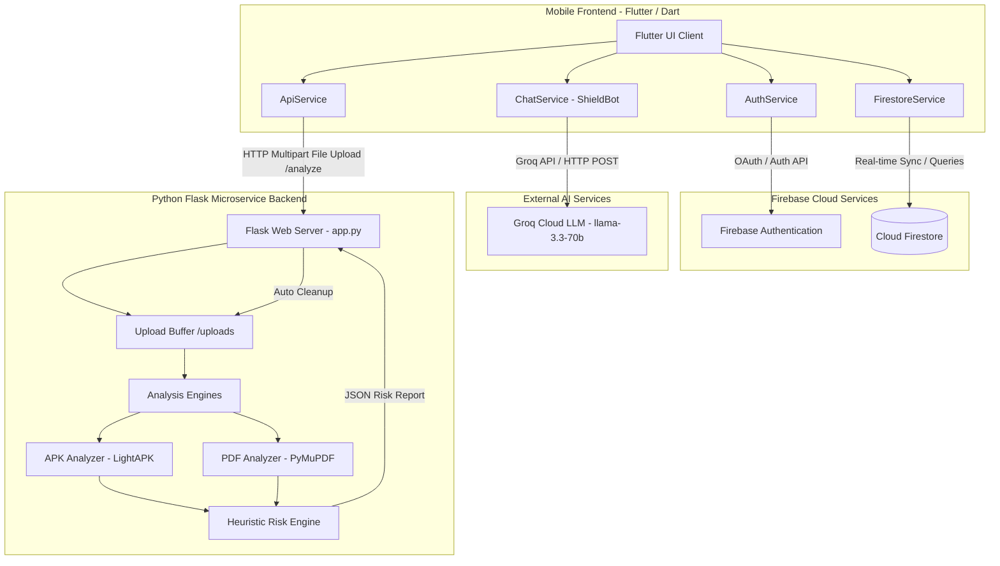

# 🛡️ ScanShield - Complete System & Technical Overview

> **Document Purpose:** This document serves as the definitive reference manual for **ScanShield**. It provides exhaustive technical documentation covering system architecture, technology stack, database schemas, backend static analysis engines, frontend screens and UI design system, service layers, API endpoint specifications, security mechanisms, and setup instructions.

---

## 📋 Table of Contents

1. [Project Overview](#-project-overview)
2. [High-Level System Architecture](#-high-level-system-architecture)
3. [Technology Stack & Dependencies](#-technology-stack--dependencies)
4. [Database Schema & Data Models (Cloud Firestore)](#-database-schema--data-models-cloud-firestore)
5. [Backend Static Analysis Microservice](#-backend-static-analysis-microservice)
6. [Frontend Application Architecture](#-frontend-application-architecture)
7. [Embedded AI Security Assistant (ShieldBot)](#-embedded-ai-security-assistant-shieldbot)
8. [UI Design System & Theme Tokens](#-ui-design-system--theme-tokens)
9. [API Specifications](#-api-specifications)
10. [Security, Privacy & Infrastructure Policies](#-security-privacy--infrastructure-policies)
11. [Setup & Execution Guide](#-setup--execution-guide)

---

## 🛡️ Project Overview

**ScanShield** is a dual-layered cybersecurity analysis and risk assessment platform built to evaluate Android Application Packages (`.apk`) and Portable Document Format (`.pdf`) documents for malicious behavior, privacy risks, and security vulnerabilities.

The platform combines a **cross-platform mobile client** built with Flutter with a **lightweight Python Flask microservice** performing static analysis, binary byte-code scanning, and heuristic risk scoring. Additionally, ScanShield integrates an embedded AI Security Assistant (**ShieldBot**) powered by Groq's LLM infrastructure (`qwen/qwen3.8-27b`) to deliver real-time risk explanations and security advice.

### Key Capabilities
- **APK Static Security Inspection:** Manifest parsing, component auditing (Activities, Services, Receivers, Providers), exported component analysis, intent filter mapping, and permission hazard categorization.
- **Direct DEX Byte-Stream Scanning:** Fast regex and binary signature scanning on `classes*.dex` files to detect suspicious API usages (`DexClassLoader`, `Runtime.exec`, SMS/Call handlers, WebViews), network indicators (URLs, IPs, WebSockets, localhost connections), cryptographic algorithms, and root evasion / anti-analysis routines (`su`, `busybox`, `Magisk`, `RootBeer`, `Frida`, `SafetyNet`, `Play Integrity`).
- **PDF Structural Inspection:** PyMuPDF-based structural parsing for encryption state, page count, and document metadata extraction.
- **Real-Time History & Cloud Synchronization:** Cloud Firestore persistence for scan history, aggregate statistics, batch scan management, and cross-session user management.
- **Context-Aware AI Guidance:** Embedded floating chatbot overlay capable of reading the active scan report context to explain security findings in human terms.

---

## 🏗️ High-Level System Architecture



---

## 🛠️ Technology Stack & Dependencies

### 1. Mobile Client (Frontend)
| Dependency | Version / Source | Purpose / Role |
| :--- | :--- | :--- |
| **Flutter SDK** | `^3.10.4` | Cross-platform UI application framework |
| **Dart** | `^3.0.0` | Core programming language |
| **Firebase Core** | `^3.6.0` / `firebase_core` | Base initialization for Firebase services |
| **Firebase Auth** | `^5.3.1` / `firebase_auth` | User authentication (Email/Password & Social OAuth) |
| **Google Sign-In** | `^6.2.1` / `google_sign_in` | Native Google OAuth 2.0 single sign-on integration |
| **Cloud Firestore** | `^5.4.4` / `cloud_firestore` | NoSQL document database for user profiles & scan logs |
| **HTTP Client** | `^1.1.0` / `http` | Multipart file upload and REST API client |
| **Flutter Dotenv** | `^5.2.1` / `flutter_dotenv` | Environment variable management (`.env`) |
| **Google Fonts** | `^6.1.0` / `google_fonts` | Typography system (`Inter` font family) |
| **FL Chart** | `^0.65.0` / `fl_chart` | Data visualization for threat metrics and risk charts |
| **Lottie** | `^2.7.0` / `lottie` | Vector animations for splash screens and loading states |
| **Flutter Markdown** | `^0.7.1` / `flutter_markdown` | Markdown rendering for chat responses and threat summaries |
| **File Picker** | `^8.0.0` / `file_picker` | Native file system selection dialog for `.apk` and `.pdf` files |

### 2. Security Microservice (Backend)
| Dependency | Version | Purpose / Role |
| :--- | :--- | :--- |
| **Python** | `3.10+` | Core backend runtime environment |
| **Flask** | `3.1.3` | Lightweight web microframework & API router |
| **Flask-CORS** | `6.0.5` | Cross-Origin Resource Sharing middleware |
| **Androguard** | `4.1.4` | Android bytecode, manifest, and APK asset parser |
| **PyMuPDF (`fitz`)** | `1.28.0` | High-performance PDF document parser and stream inspector |
| **Python-Dotenv** | `1.2.2` | Environment configuration parser |

### 3. AI Assistant Integration
- **LLM Engine:** `qwen/qwen3.8-27b` hosted on Groq Cloud API (configurable via `GROQ_MODEL`).
- **Protocol:** OpenAI-compatible Chat Completions HTTP POST endpoint (`https://api.groq.com/openai/v1/chat/completions`).

---

## 🗄️ Database Schema & Data Models (Cloud Firestore)

ScanShield utilizes Google Cloud Firestore as its primary data store. The database consists of three main collections:

### 1. `users` Collection
Stores registered user profile records created during Email/Password or Google Sign-In registration.

* **Document ID:** `{uid}` (Firebase User Unique ID)

| Field Name | Type | Description |
| :--- | :--- | :--- |
| `uid` | String | Unique Firebase authentication ID |
| `email` | String | User email address |
| `name` | String | Full user display name |
| `created_at` | Timestamp | Account creation server timestamp |
| `last_login` | Timestamp | Last authentication server timestamp |
| `total_scans` | Number (Integer) | Cumulative count of file scans executed by the user |

### 2. `scans` Collection
Stores historical scan reports generated whenever a user scans an `.apk` or `.pdf` file.

* **Document ID:** Auto-generated document key

| Field Name | Type | Description |
| :--- | :--- | :--- |
| `user_id` | String | References the `uid` of the user who initiated the scan |
| `file_name` | String | Base name of the scanned file |
| `file_type` | String | File category: `'apk'` or `'pdf'` |
| `package_name` | String (Optional) | Android package identifier (e.g. `com.example.app`) |
| `app_name` | String (Optional) | Extracted Android application label |
| `permissions` | Array<String> (Optional) | List of requested Android permissions |
| `pages` | Number (Optional) | Page count (PDF files) |
| `is_encrypted` | Boolean (Optional) | Encryption status flag (PDF files) |
| `metadata` | Map<String, Dynamic> | Additional structural metadata |
| `overall_risk` | Number (Integer) | Calculated risk score (0 to 100) |
| `risk_level` | String | Categorized risk level: `'Low'`, `'Medium'`, or `'High'` |
| `scanned_at` | Timestamp | Timestamp when the scan was processed |

### 3. `stats` Collection
Maintains aggregate global platform metrics for system monitoring.

* **Document ID:** `global_stats`

| Field Name | Type | Description |
| :--- | :--- | :--- |
| `total_scans` | Number (Integer) | Global platform scan counter |
| `low_count` | Number (Integer) | Aggregate count of files categorized as Low Risk |
| `medium_count` | Number (Integer) | Aggregate count of files categorized as Medium Risk |
| `high_count` | Number (Integer) | Aggregate count of files categorized as High Risk |

---

## ⚙️ Backend Static Analysis Microservice

The backend service is located in `backend/` and exposes HTTP API endpoints for receiving files, performing static analysis, calculating heuristic risk, and returning structured JSON payloads.

```
backend/
├── analyzer/
│   ├── apk_analyzer.py    # APK Manifest & DEX Byte-Stream Analyzer
│   ├── pdf_analyzer.py    # PyMuPDF Structural Inspector
│   └── risk_engine.py     # Heuristic Risk Scoring Engine
├── reports/               # Optional analysis report logs
├── uploads/               # Temporary file buffer directory
├── .env                   # Local server configuration
├── app.py                 # Flask server entry point & HTTP router
└── requirements.txt       # Python dependencies
```

### Key Backend Components & Functions

#### 1. `app.py` (Flask Server Entry Point)
- **`home()` (`GET /`)**: Health check and warm-up endpoint. Returns server status, version, and route metadata.
- **`analyze()` (`POST /analyze`)**: Main file analysis endpoint.
  - Validates request payload for presence of `'file'` multipart form data.
  - Restricts supported extensions strictly to `.apk` and `.pdf`.
  - Enforces `MAX_CONTENT_LENGTH` limit of **100 MB** (handles HTTP 413 error).
  - Saves file to temporary buffer `uploads/`.
  - Routes execution to `analyze_apk()` or `analyze_pdf()`.
  - Computes final risk score via `calculate_risk()`.
  - **Buffer Sanitation:** Guarantees deletion of uploaded files from `uploads/` inside a `finally:` block regardless of success or exception.

#### 2. `backend/analyzer/apk_analyzer.py` (APK Analysis Engine)
Contains the core static analysis logic for Android APK files.

- **`LightAPK(APK)` Subclass:**
  - **Memory Optimization:** Subclasses Androguard's standard `APK` class to bypass standard `ZipEntry.parse` operations.
  - Utilizes Python's native `zipfile.ZipFile` streaming to read only required files (e.g. `AndroidManifest.xml`, `classes*.dex`) on-demand.
  - **RAM Savings:** Reduces memory footprint from **>200 MB down to <25 MB**, enabling smooth execution on resource-constrained servers.

- **Manifest Inspection & Extraction:**
  - Extracts package metadata: `package_name`, `app_name`, `version_name`, `version_code`, `min_sdk`, `target_sdk`, `shared_user_id`, `install_location`.
  - Application configuration flags: `debuggable`, `allowBackup`, `usesCleartextTraffic`, `networkSecurityConfig`.
  - Single-pass component parsing: Identifies all declared `Activities`, `Services`, `Broadcast Receivers`, and `Content Providers`.
  - Exported component analysis: Evaluates whether components are exported (`exported="true"` or implicit via intent filters).
  - Launcher activity identification: Locates the primary entry activity (`MAIN` + `LAUNCHER`).

- **Permission Categorization:**
  - **Critical Permissions:** `REQUEST_INSTALL_PACKAGES`, `SYSTEM_ALERT_WINDOW`, `BIND_ACCESSIBILITY_SERVICE`, `BIND_DEVICE_ADMIN`, `QUERY_ALL_PACKAGES`, `PACKAGE_USAGE_STATS`.
  - **Dangerous Permissions:** `READ_SMS`, `SEND_SMS`, `RECEIVE_SMS`, `READ_CONTACTS`, `WRITE_CONTACTS`, `READ_CALL_LOG`, `CAMERA`, `RECORD_AUDIO`, `ACCESS_FINE_LOCATION`, `ACCESS_COARSE_LOCATION`, `READ_EXTERNAL_STORAGE`, `WRITE_EXTERNAL_STORAGE`, `MANAGE_EXTERNAL_STORAGE`, `RECEIVE_BOOT_COMPLETED`, `FOREGROUND_SERVICE`.
  - **Normal Permissions:** `INTERNET`, `ACCESS_NETWORK_STATE`, `ACCESS_WIFI_STATE`, `VIBRATE`, `WAKE_LOCK`, `BLUETOOTH`, etc.

- **DEX Byte-Stream Scanning:**
  - Iterates over all `classes*.dex` streams without constructing full Abstract Syntax Trees (ASTs).
  - Matches binary byte signatures for suspicious APIs: `DexClassLoader`, `PathClassLoader`, `Runtime.exec`, `ProcessBuilder`, `SmsManager`, `TelephonyManager`, `WebView`, `addJavascriptInterface`.
  - Detects network indicators using regex matching: URLs, IP addresses, WebSockets (`ws://`, `wss://`), and local loopback bindings (`localhost`, `127.0.0.1`).
  - Detects cryptographic algorithms: AES, DES, RSA, MD5, SHA1, SHA256.
  - Identifies root evasion & anti-analysis techniques: `su`, `busybox`, `Magisk`, `Superuser`, `RootBeer`, `Xposed`, `Frida`, `SafetyNet`, `Play Integrity`.

#### 3. `backend/analyzer/pdf_analyzer.py` (PDF Analysis Engine)
- **`analyze_pdf(file_path)`**:
  - Opens document using `fitz.open()` (PyMuPDF).
  - Extracts structural attributes: `pages` (page count), `is_encrypted` (boolean flag), and document `metadata` (author, creator, title, producer, creation date).

#### 4. `backend/analyzer/risk_engine.py` (Risk Engine)
- **`calculate_risk(data)`**: Heuristic scoring function evaluating output metrics to compute an `overall_risk` integer (0-100) and assign a `risk_level` (`Low`, `Medium`, or `High`).

---

## 📱 Frontend Application Architecture

The mobile client is located in `lib/` and structured according to clean architecture principles with separate data models, services, UI screens, widgets, and utility modules.

```
lib/
├── chatbot/                   # AI Security Assistant (ShieldBot) overlay & services
│   ├── chat_message.dart      # Chat message data model
│   ├── chat_service.dart      # Groq API HTTP client
│   ├── chatbot_screen.dart    # Chatbot modal screen view
│   ├── draggable_chatbot_overlay.dart # Global floating overlay widget
│   └── system_prompt.dart     # System prompts & report context generator
├── models/                    # Data transfer objects & models
│   ├── scan_model.dart        # Scan report model
│   └── user_model.dart        # User profile model
├── screens/                   # Application views
│   ├── tabs/
│   │   ├── dashboard_tab.dart # Main dashboard view
│   │   └── profile_tab.dart   # User profile & settings view
│   ├── history_screen.dart    # Scan history, search & batch operations
│   ├── home_screen.dart       # Bottom navigation wrapper host
│   ├── login_screen.dart      # Email/Password & Google OAuth authentication
│   ├── report_screen.dart     # Detailed scan report visualizer
│   ├── scan_screen.dart       # File picker & real-time scan workflow
│   ├── signup_screen.dart     # User registration view
│   └── splash_screen.dart     # Animated splash & backend warm-up
├── services/                  # Business logic & external API clients
│   ├── api_service.dart       # Flask backend HTTP client
│   ├── auth_service.dart      # Firebase Auth & Google Sign-In service
│   └── firestore_service.dart # Cloud Firestore database service
├── utils/                     # Design system & helper utilities
│   ├── constants.dart         # Global constants & API endpoints
│   ├── date_formatter.dart    # DateTime formatting helpers
│   ├── permission_descriptions.dart # Android permission descriptions catalog
│   ├── recommendation_helper.dart  # Dynamic threat recommendation engine
│   ├── text_styles.dart       # Typography styles
│   └── theme.dart             # AppTheme & AppColors token definition
├── widgets/                   # Reusable UI components
│   ├── custom_button.dart     # Primary & outlined styled buttons
│   ├── empty_state.dart       # Generic empty state indicator
│   ├── info_row.dart          # Label-value pair row widget
│   ├── loading_overlay.dart   # Full-screen modal loading spinner
│   ├── permission_chip.dart   # Interactive permission chip with detail dialogs
│   ├── risk_indicator.dart    # Status badge for risk level
│   ├── risk_score_circle.dart # Radial gauge painter for risk scores
│   ├── scan_card.dart         # History scan summary item card
│   ├── search_bar.dart        # Search input component
│   ├── section_header.dart    # Section title header
│   └── stat_card.dart         # Dashboard statistics metric widget
├── firebase_options.dart      # Firebase configuration generator
└── main.dart                  # Application entry point
```

### Core Frontend Services

1. **`ApiService` (`lib/services/api_service.dart`)**:
   - `analyzeFile(File file)`: Performs pre-upload file existence and length checks. Initiates an HTTP Multipart POST request to `/analyze`. Features explicit connection timeouts (45 seconds) and handles response decoding and status codes.
   - `checkServerStatus()`: Performs a lightweight health check `GET /` ping.
   - `warmUpBackend()`: Asynchronous non-blocking ping invoked on application boot to wake backend servers from cold starts.

2. **`AuthService` (`lib/services/auth_service.dart`)**:
   - `signUp(...)`: Registers users via Firebase Auth and creates user records in Cloud Firestore.
   - `signIn(...)`: Authenticates users and updates `last_login` timestamps.
   - `signInWithGoogle()`: Native Google OAuth 2.0 flow using `GoogleSignIn` and Firebase `GoogleAuthProvider`. Automatically initializes user profiles in Firestore for first-time sign-ins.
   - `signOut()`: Terminates Firebase and Google Sign-In sessions.
   - `resetPassword(...)`: Triggers password reset emails.
   - `_handleAuthException(...)`: Maps raw Firebase and platform errors to human-readable user messages.

3. **`FirestoreService` (`lib/services/firestore_service.dart`)**:
   - `getUserData(uid)` / `getUserDataStream(uid)`: Fetches or streams live user profile documents.
   - `getUserScans(uid)` / `getUserScansStream(uid)`: Fetches or streams scan records ordered by `scanned_at` descending.
   - `saveScanResult(ScanModel scan)`: Persists scan reports to Firestore and increments user and global threat statistics.
   - `deleteScan(scanId)` / `deleteMultipleScans(scanIds)`: Deletes individual scan records or commits batch deletions (`WriteBatch`).
   - `getScansByFilter(...)`: Supports filtering by risk level (`High`, `Medium`, `Low`), date range (`dateFrom`, `dateTo`), and client-side sorting (`Newest First`, `Oldest First`, `Highest Risk Score`, `Lowest Risk Score`, `Name (A-Z)`).

---

## 🤖 Embedded AI Security Assistant (ShieldBot)

ScanShield includes **ShieldBot**, an embedded AI cybersecurity assistant designed to assist users in understanding technical security findings.

### Architectural Breakdown
- **Global Availability:** Implemented via `DraggableChatbotOverlay` wrapped around application routes, making a floating shield button visible on every screen.
- **Groq API Integration (`ChatService`):** Connects to Groq API using the `qwen/qwen3.8-27b` model with a 30-second connection timeout and token history truncation (limits context to the last 10 messages).
- **Dynamic Context Injection (`ShieldBotPrompt`):**
  - When invoked from a **Report Screen**, the chatbot automatically extracts file details, risk scores, requested permissions, suspicious APIs, and findings into a formatted context block (`buildReportContext`).
  - Prepends the report context to the system prompt, enabling ShieldBot to answer specific questions about the active report (e.g. *"Why is this APK rated High Risk?"* or *"What can SMS permissions do?"*).

---

## 🎨 UI Design System & Theme Tokens

ScanShield features a **Light Security Design System** defined in `lib/utils/theme.dart`.

### 1. Color Palette (`AppColors`)
- **Primary Brand:** Deep Teal-Blue (`#1B5E7B`) & Lighter Teal-Blue (`#2980B9`)
- **Secondary Accent:** Warm Teal (`#0D9488`) & Light Teal (`#14B8A6`)
- **Semantic Colors:**
  - **Danger (High Risk):** Crimson Red (`#DC2626`)
  - **Warning (Medium Risk):** Amber (`#D97706`)
  - **Safe (Low Risk):** Emerald Green (`#16A34A`)
  - **Info:** Royal Blue (`#2563EB`)
- **Surfaces:** Cool Off-White Background (`#F8FAFB`), Pure White Cards (`#FFFFFF`), Light Slate Gray (`#F1F5F9`)

### 2. Radius Tokens (`AppRadius`)
- `small`: 8.0px
- `medium`: 12.0px
- `large`: 16.0px
- `xl`: 20.0px
- `xxl`: 24.0px
- `pill`: 50.0px

### 3. Application Views & Screens
1. **`SplashScreen`:** Initial branding view displaying Lottie animations and triggering backend warm-up.
2. **`LoginScreen`:** Dual login view supporting Email/Password and Google OAuth, password visibility toggling, and reset password modal.
3. **`SignupScreen`:** User registration interface with input validation.
4. **`HomeScreen`:** Core container hosting bottom navigation tabs (`DashboardTab` and `ProfileTab`).
5. **`DashboardTab`:** Main security hub displaying quick stats cards (Total Scans, Malicious Detected, Safe Files), action cards for scanning APK / PDF, and recent scan logs.
6. **`ProfileTab`:** User account screen showing avatar badge, email, scan statistics summary, design theme settings, and sign-out triggers.
7. **`ScanScreen`:** Drag-and-drop file selection screen supporting APK and PDF selection via `file_picker`, real-time progress indicators, and error banners.
8. **`ReportScreen`:** Comprehensive scan report viewer featuring:
   - Custom radial risk gauge (`RiskScoreCircle`).
   - Risk status badge (`RiskIndicator`).
   - Categorized findings list and contextual recommendations (`RecommendationHelper`).
   - Interactive permission chips (`PermissionChip`) opening explanation bottom sheets (`PermissionDescriptions`).
   - Security risk flags grid, network/crypto indicators list, and raw metadata inspection modal.
9. **`HistoryScreen`:** Full record log offering:
   - Search bar filtering by file or package name.
   - Categorical filter chips (All, High, Medium, Low).
   - Multi-criteria sorting dropdown.
   - Batch selection mode enabling multi-item deletion via Firestore batch operations.

---

## 📡 API Specifications

### Base URL: `http://<HOST>:<PORT>` (Default: `http://localhost:5000`)

### 1. Health Check & Warm-Up
* **Endpoint:** `GET /`
* **Headers:** None
* **Success Response (200 OK):**
```json
{
  "message": "ScanShield Backend Running",
  "status": "success",
  "version": "1.0.0",
  "service": "ScanShield API",
  "endpoints": [
    "/",
    "/analyze"
  ]
}
```

### 2. File Security Analysis
* **Endpoint:** `POST /analyze`
* **Content-Type:** `multipart/form-data`
* **Payload Parameter:** `file` (Binary payload of `.apk` or `.pdf` up to 100 MB)
* **Success Response (200 OK - Sample APK Result):**
```json
{
  "app_name": "Sample Application",
  "package_name": "com.security.example",
  "version_name": "1.0.4",
  "version_code": "104",
  "min_sdk": "21",
  "target_sdk": "33",
  "overall_risk": 75,
  "risk_level": "High",
  "permissions": [
    "android.permission.INTERNET",
    "android.permission.SEND_SMS",
    "android.permission.SYSTEM_ALERT_WINDOW"
  ],
  "permissions_breakdown": {
    "Critical": ["android.permission.SYSTEM_ALERT_WINDOW"],
    "Dangerous": ["android.permission.SEND_SMS"],
    "Normal": ["android.permission.INTERNET"],
    "Unknown": []
  },
  "uses_sms": true,
  "uses_overlay": true,
  "uses_accessibility": false,
  "uses_dynamic_loading": false,
  "uses_root_detection": false,
  "exported_components": 3,
  "network_indicators": {
    "urls": ["https://api.example.com"],
    "ips": ["192.168.1.1"],
    "localhost": false,
    "websocket": false
  },
  "crypto_indicators": ["AES", "SHA256"],
  "suspicious_apis": ["android/telephony/SmsManager"]
}
```
* **Error Responses:**
  - `400 Bad Request`: Missing file, empty filename, or unsupported extension.
  - `413 Payload Too Large`: Upload exceeds 100 MB limit.
  - `500 Internal Server Error`: Parsing or inspection exception.

---

## 🔒 Security, Privacy & Infrastructure Policies

1. **Zero Persistent Storage on Backend:** All uploaded files saved to `backend/uploads/` are processed transiently and deleted immediately in a `finally` block following scan execution.
2. **Environment Variable Protection:** Secrets (API keys, ports, Firebase options) are isolated in `.env` files and excluded from source control via `.gitignore`.
3. **Payload Guardrails:** Request payload size is strictly capped at **100 MB** (`MAX_CONTENT_LENGTH`) to prevent Denial of Service (DoS) memory exhaustion.
4. **Memory-Safe APK Inspection:** Custom `LightAPK` loader stream-reads ZIP contents using native Python `zipfile`, preventing memory spikes (>90% RAM reduction) during peak analysis loads.

---

## 🚀 Setup & Execution Guide

### Prerequisites
- Flutter SDK (`>= 3.10.4`)
- Python (`>= 3.10`)
- Firebase project configured with Authentication & Cloud Firestore

---

### 1. Backend Service Setup

```bash
# 1. Navigate to backend directory
cd backend

# 2. Create and activate a virtual environment
python3 -m venv venv
source venv/bin/activate   # On Windows: venv\Scripts\activate

# 3. Install required Python packages
pip install -r requirements.txt

# 4. (Optional) Create .env file
echo "PORT=5000" > .env

# 5. Start the Flask server
python app.py
```
*The backend service will start on `http://localhost:5000` (or `http://0.0.0.0:5000`).*

---

### 2. Mobile Frontend Setup

```bash
# 1. Install Flutter dependencies
flutter pub get

# 2. Verify environment configuration (.env file in root directory)
# Ensure API endpoint matches your backend host IP/URL
# Example: API_BASE_URL=http://10.0.2.2:5000 for Android Emulator

# 3. Run the application
flutter run
```

---

### 3. Running Unit & Integration Tests

```bash
# Run Flutter widget & unit tests
flutter test
```

---

*ScanShield Project Overview & Architecture Reference Manual — Maintained for Developers & AI Agents.*
